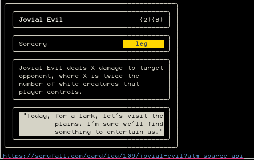

# mtg-rand-card

This is a little python script that utilizes the [Rich](https://github.com/Textualize/rich) library and [Scryfall](https://scryfall.com/docs/api) API to grab a random card and display it in the console.

## Usage
Make sure you've got Rich on your system and an internet connection, and just run the script.

## Todo
- CLI argments
  - Passing search parameters to Scryfall via the console would be nice
- Planeswalker-specific display logic
- Card coloring
- Border color/acorn badge

